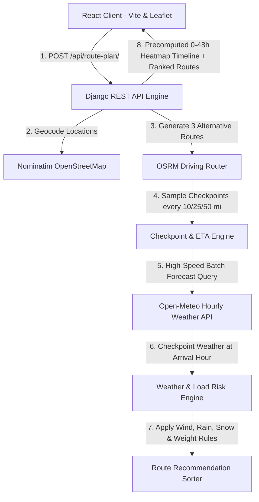

# Weather-Aware Truck Routing 🚛🌦️

A high-fidelity Full-Stack logistics decision platform built for the **Spotter AI Full Stack Developer Assessment**. This web application helps commercial truck drivers and dispatchers choose the safest and most efficient route balancing **real-time weather hazards**, **truck load weight**, and **travel time**.

---

## 🏗️ System Architecture



---

## 📋 Assessment Specification & Implementation

### 1. Risk Classification Matrix
Thresholds strictly implemented in `backend/routing/services/risk_engine.py`:

| Condition | Low | Moderate | High | Severe | No Travel |
| :--- | :---: | :---: | :---: | :---: | :---: |
| **Wind Speed** | `< 25 mph` | `25 – 34 mph` | `35 – 44 mph` | `45 – 54 mph` | `≥ 55 mph` |
| **Precipitation (Rain)** | `< 0.10 in/hr` | `0.10 – 0.25` | `0.25 – 0.50` | `0.50 – 1.00` | `> 1.00 in/hr` |
| **Snowfall** | `< 0.5 in/hr` | `0.5 – 1.0` | `1.0 – 2.0` | `2.0 – 3.0` | `> 3.0 in/hr` |

### 2. Truck Load Weight Rules
* **$\ge 55\text{ mph}$ Wind:** Evaluates to `No Travel` for **any** load weight.
* **$45 – 54\text{ mph}$ Wind + $> 30,000\text{ lb}$ Load:** Automatically elevated to `No Travel` (blowover risk prevention).
* **$35 – 44\text{ mph}$ Wind + $> 40,000\text{ lb}$ Load:** Automatically elevated to `Severe` (heavy crosswind destabilization).

### 3. Route Recommendation Priority
All 3 generated routes are ranked based on the strict 4-tier preference order:
1. **Fewest Severe miles** (including any `No Travel` miles)
2. **Fewest High miles**
3. **Lowest average risk score**
4. **Shortest travel times**

---

## 🌟 Key Features

* **3 Guaranteed Route Options:** Evaluates primary and alternate highway corridors simultaneously.
* **ETA-Synchronized Checkpoint Sampling:** Samples weather every **10 / 25 / 50 miles** based on the truck's exact estimated arrival timestamp at each point.
* **High-Performance Batch Weather:** Queries Open-Meteo in batched requests, retrieving complete forecast data in **< 200ms**.
* **0–48 Hour Forecast Slider & Weather Heatmap (35% Rubric):** Drag slider or press play to scrub through the 48-hour corridor forecast at 60fps with zero network latency.
* **Interactive Leaflet Map:** Displays all 3 routes, start/destination pins, and risk-colorized checkpoint pins with detailed meteorological popups.
* **Hazard Audit Table:** Sortable and filterable table detailing miles, ETA, temperature, wind, rain, snow, and load weight alerts for every checkpoint.
* **Automated Test Suite:** 6 comprehensive unit tests verifying risk thresholds and load weight combinations (`manage.py test`).

---

## 💻 Tech Stack

* **Frontend:** React 19, Vite, Leaflet, Vanilla CSS.
* **Backend:** Django 6, Django REST Framework, Django CORS Headers, Requests, Gunicorn.
* **APIs:** Nominatim OpenStreetMap (Geocoding), OSRM (Routing), Open-Meteo (Hourly Weather).

---

## 🚀 Local Quickstart Guide

### Prerequisites
* Python 3.10+
* Node.js 18+

### 1. Backend Setup
```bash
cd backend
python -m venv venv

# Windows
venv\Scripts\activate
# Linux/macOS
# source venv/bin/activate

pip install -r requirements.txt
python manage.py migrate
python manage.py test  # Run unit tests
python manage.py runserver 127.0.0.1:8000
```
Backend runs at `http://127.0.0.1:8000/`.

### 2. Frontend Setup
In a new terminal window:
```bash
cd frontend
npm install
npm run dev
```
Frontend runs at `http://localhost:5173/`.

---

## 🔌 API Reference

### `POST /api/route-plan/`
Evaluates 3 alternative routes and generates 0–48h corridor heatmap data.

**Request Payload:**
```json
{
  "origin": "Dallas, TX",
  "destination": "Chicago, IL",
  "departure_time": "2026-10-10T08:00:00Z",
  "load_weight": 42000,
  "sample_interval_miles": 25
}
```

**Response (Summary):**
```json
{
  "status": "success",
  "recommended_route_id": "route_1",
  "routes": [
    {
      "id": "route_1",
      "name": "Primary Highway Route",
      "is_recommended": true,
      "distance_miles": 966.7,
      "duration_hours": 17.11,
      "summary": {
        "severe_miles": 0.0,
        "high_miles": 0.0,
        "moderate_miles": 0.0,
        "low_miles": 966.7,
        "average_risk_score": 1.0,
        "route_status": "Safe Travel"
      },
      "checkpoints": [...]
    }
  ],
  "heatmap_timeline": [
    {
      "hour_offset": 0,
      "points": [...]
    }
  ]
}
```
