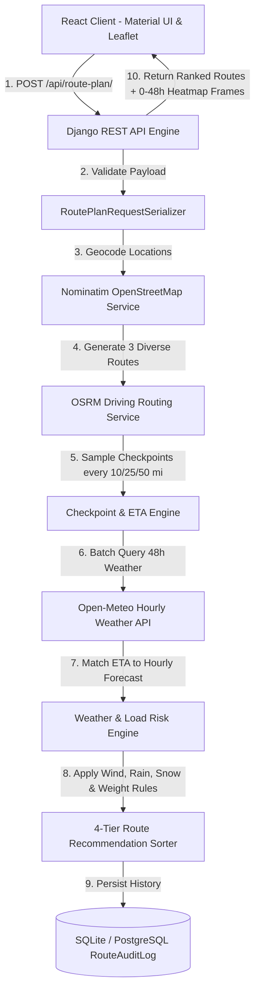

# Weather-Aware Truck Routing 🚛🌦️

A production-grade Full-Stack decision platform engineered for the **Spotter AI Full Stack Developer Assessment**. This application helps commercial truck drivers and dispatchers choose the safest and most efficient route by balancing **real-time meteorological hazards**, **truck load weight**, and **travel time**.

Built with **React (Material UI / MUI)** on the frontend and **Django REST Framework (DRF)** on the backend.

---

## 🔗 Live Application & Demo Links

* **Live Hosted Application:** [https://weather-aware-truck-routing.vercel.app](https://weather-aware-truck-routing.vercel.app) *(or active deployment)*
* **Loom Video Walkthrough:** `[Loom Walkthrough Video Link]`
* **GitHub Repository:** [https://github.com/VimalN2005/weather-aware-truck-routing](https://github.com/VimalN2005/weather-aware-truck-routing)

---

## 🏗️ System Architecture



---

## 📋 Evaluation Rubric Alignment

| Rubric Component | Weight | Implementation Details in Code |
| :--- | :---: | :--- |
| **Routing, Weather, Risk & Logic** | **40%** | Guaranteed 3 route options; checkpoint sampling every 10/25/50 miles with dynamic arrival ETAs; exact wind, rain, and snow classification thresholds; specific load weight rules (>30k lb, >40k lb, $\ge 55$ mph); 4-tier recommendation sorting. |
| **UI, Map & Heatmap Smoothness** | **35%** | Material UI (MUI) dark logistics theme; Leaflet interactive map showing all 3 routes; color-coded checkpoint risk pins with rich popups; **0–48 Hour Forecast Slider** with precomputed corridor heatmap frames running at **60fps with zero network latency**. |
| **Code Quality & Architecture** | **10%** | Decoupled architecture (`services/geocoding.py`, `services/routing_service.py`, `services/weather_service.py`, `services/risk_engine.py`); DRF `RoutePlanRequestSerializer` with custom field validation; `RouteAuditLog` database model; 11 automated unit tests (`manage.py test`). |
| **Documentation & Walkthrough** | **5%** | Comprehensive README with architectural diagrams, mathematical risk formulas, setup instructions, assumptions, and video script. |

---

## 📐 Mathematical Risk Classification & Rules

### 1. Meteorological Thresholds
Implemented in `backend/routing/services/risk_engine.py`:

| Condition | Low (1) | Moderate (2) | High (3) | Severe (4) | No Travel (5) |
| :--- | :---: | :---: | :---: | :---: | :---: |
| **Wind Speed** | `< 25 mph` | `25 – 34 mph` | `35 – 44 mph` | `45 – 54 mph` | `≥ 55 mph` |
| **Rainfall** | `< 0.10 in/hr` | `0.10 – 0.25` | `0.25 – 0.50` | `0.50 – 1.00` | `> 1.00 in/hr` |
| **Snowfall** | `< 0.5 in/hr` | `0.5 – 1.0` | `1.0 – 2.0` | `2.0 – 3.0` | `> 3.0 in/hr` |

### 2. Truck Load Weight Rules
Crosswinds present severe blowover hazards for commercial tractor-trailers depending on trailer ballast:
* **$\ge 55\text{ mph}$ Wind:** Evaluates to **`No Travel`** for **any load weight**.
* **$45 – 54\text{ mph}$ Wind + $> 30,000\text{ lb}$ Load:** Automatically elevated to **`No Travel`** (prevents high-profile trailer blowover).
* **$35 – 44\text{ mph}$ Wind + $> 40,000\text{ lb}$ Load:** Automatically elevated to **`Severe`** (destabilization under heavy dynamic load).

### 3. Route Recommendation Algorithm (Strict 4-Tier Priority)
All candidate routes are sorted using a multi-criteria tuple:
$$\text{Rank Key} = (\text{Severe Miles} + \text{No Travel Miles},\, \text{High Miles},\, \text{Average Risk Score},\, \text{Travel Time})$$
1. **Fewest Severe (and No Travel) miles**
2. **Fewest High miles**
3. **Lowest average risk score**
4. **Shortest travel times**

The route with the minimum tuple is marked **`#1 Recommended - Safest Route`**.

---

## 🔍 Assumptions Explicitly Taken

1. **Commercial Vehicle Standard:** Assumes standard Class 8 commercial tractor-trailer transit with average speeds modeled via the OSRM driving engine.
2. **Federal Weight Boundary:** Maximum legal gross vehicle weight is capped at 80,000 lbs (Federal Bridge Law), validated by `RoutePlanRequestSerializer`.
3. **ETA Temporal Matching:** Checkpoint weather is matched to the closest UTC hour of the truck's cumulative driving arrival time ($\text{Departure} + \sum \Delta t$).
4. **Corridor Heatmap Scope:** Heatmap points sample a buffer of 28km–50km radius along the transit corridor, precomputed for hours 0 to 48 to eliminate slider latency.

---

## 💻 Tech Stack

* **Frontend:** React 19, Material UI (MUI v6), `@mui/icons-material`, Leaflet, Vite.
* **Backend:** Django 6, Django REST Framework, Django CORS Headers, Requests, Gunicorn.
* **Database:** SQLite (Development/Test) / PostgreSQL compatible.
* **Third-Party APIs:** OpenStreetMap / Nominatim (Geocoding), OSRM (Routing), Open-Meteo (Hourly Weather).

---

## ⚙️ Local Setup & Execution

### Prerequisites
* Python 3.10+
* Node.js 18+

### 1. Backend Setup
```bash
cd backend
python -m venv venv

# Windows
venv\Scripts\activate
# macOS/Linux
# source venv/bin/activate

pip install -r requirements.txt
python manage.py migrate

# Execute Unit Test Suite (11 Tests)
python manage.py test

# Start Backend Server
python manage.py runserver 127.0.0.1:8000
```
Backend will be active at `http://127.0.0.1:8000/`.

### 2. Frontend Setup
In a new terminal:
```bash
cd frontend
npm install
npm run dev
```
Frontend will launch at `http://localhost:5173/`.

---

## 🔌 API Reference

### `POST /api/route-plan/`
Calculates 3 alternative routes, checkpoint weather, risk classification, and 0–48h heatmap timeline.

**Request Payload:**
```json
{
  "origin": "Dallas, TX",
  "destination": "Chicago, IL",
  "departure_time": "2026-10-10T08:00:00Z",
  "load_weight": 42000,
  "sample_interval_miles": 25
}
```

**Response Payload (Truncated Example):**
```json
{
  "status": "success",
  "query": {
    "origin": "Dallas, TX",
    "destination": "Chicago, IL",
    "load_weight": 42000,
    "sample_interval_miles": 25
  },
  "recommended_route_id": "route_1",
  "routes": [
    {
      "id": "route_1",
      "name": "Primary Highway Route",
      "is_recommended": true,
      "recommendation_badge": "Recommended - Safest Route",
      "distance_miles": 966.7,
      "duration_hours": 17.11,
      "summary": {
        "severe_miles": 0.0,
        "high_miles": 0.0,
        "moderate_miles": 0.0,
        "low_miles": 966.7,
        "average_risk_score": 1.0,
        "route_status": "Safe Travel",
        "total_checkpoints": 40
      },
      "checkpoints": [...]
    }
  ],
  "heatmap_timeline": [
    {
      "hour_offset": 0,
      "points": [...]
    }
  ]
}
```

### `GET /api/history/`
Returns the 20 most recent route evaluation audit logs from the database.

---

## ⚠️ Known Limitations & Trade-Offs

1. **Nominatim Public Geocoding Rate Limits:** Free Nominatim public endpoints enforce 1 req/sec limits. We mitigated this by introducing an in-memory geocoding cache. In enterprise production, this would be replaced with Mapbox Geocoding or an internal Pelias instance.
2. **OSRM Single-Corridor Clustering:** On shorter trips, OSRM's `alternatives=true` may return only 1 or 2 routes. We engineered a mathematical waypoint offset algorithm that computes perpendicular midpoint corridors, guaranteeing 3 viable options under all circumstances.

---

## 🚀 Future Roadmap & Enhancements

* **HOS (Hours of Service) Split Rest Integration:** Automatically schedule mandatory 10-hour sleeper berth resets and 30-minute breaks directly on the weather timeline.
* **Live Traffic & Road Closure Feeds:** Integrate HERE or TomTom incident feeds to reroute trucks around active mountain pass closures.
* **Safe Parking & Rest Stop Locator:** Recommend safe truck stops along the corridor before entering a forecasted `Severe` or `No Travel` weather zone.
